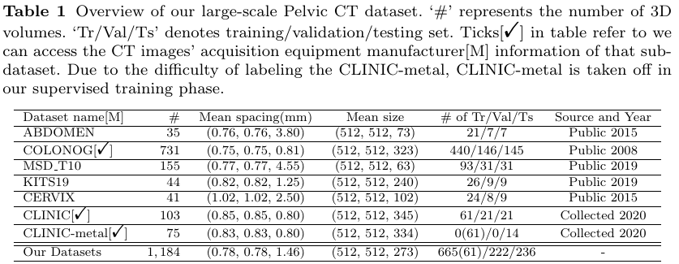
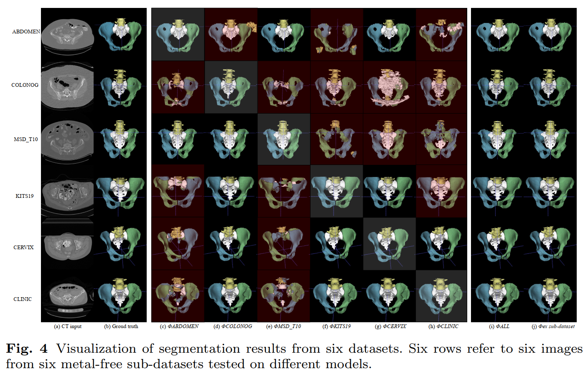
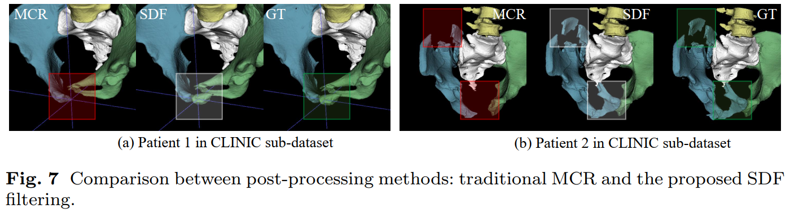

# Introduction 
***Submission to IPCAI 2021.*** url for arxiv

***Purpose***: Pelvic bone segmentation in CT has always been an essential
step in clinical diagnosis and surgery planning of pelvic bone diseases. Existing
methods for pelvic bone segmentation are either hand-crafted or semi-automatic
and achieve limited accuracy when dealing with image appearance variations due
to the multi-site domain shift, the presence of contrasted vessels, coprolith and
chyme, bone fractures, low dose, metal artifacts, etc. Due to the lack of a large-scale
pelvic CT dataset with annotations, deep learning methods are not fully explored.

***Methods***: In this paper, we aim to bridge the data gap by curating a large pelvic CT
dataset pooled from multiple sources and different manufacturers, including 1, 184
CT volumes and over 320, 000 slices with different resolutions and a variety of the
above-mentioned appearance variations. Then we propose for the first time, to the
best of our knowledge, to learn a deep multi-class network for segmenting lumbar
spine, sacrum, left hip, and right hip, from multiple-domain images simultaneously
to obtain more effective and robust feature representations. Finally, we introduce a
post-processing tool based on the signed distance function (SDF) to eliminate false
predictions while retaining correctly predicted bone fragments. 

***Results***: Extensive
experiments on our dataset demonstrate the effectiveness of our automatic method,
achieving an average Dice of 0.987 for a metal-free volume. SDF post-processor
yields a decrease of 10.5% in hausdorff distance by maintaining important bone
fragments in post-processing phase. 

***Conclusion***: We believe this large-scale dataset
will promote the development of the whole community and plan to open source
the images, annotations, codes, and trained baseline models at this repository.

For more information about **CTPelvic1K** dataset, please read the following paper:

`Pengbo Liu, Hu Han, Yuanqi Du, Heqin Zhu, Yinhao Li, Feng Gu, Honghu Xiao, Jun Li, Chunpeng Zhao, Li Xiao, Xinbao Wu, 
S.Kevin Zhou. Deep Learning to Segment Pelvic Bones: Large-scale CT Datasets and Baseline Models. arXiv preprint arXiv:**** (2021).`

Please also cite this paper if you are using **CTPelvic1K** dataset for your research!

Overview of our large-scale CT Pelvic dataset (CTPelvic1K) is shown in Table 1.



This repository is still work in progress. Annotations will continue to be enriched with other bone structures and other further applications (surgical reduction). 
If you encounter any problems while using **CTPelvic1K** dataset, please let us know.

# Getting Started 
All the commands in this section assume that you are in a terminal and your working directory is the `CTPelvic1K` folder 
(the one that has all the subfolders like `dataset_conversion`, `evaluation`, ...)

And all commands are already writen in `CTPelvic1K/nnunet/runs.py`.

## Table of Contents
- [Set paths](#1-set-paths)
- [Preparing Datasets & Experiment Planning & Preprocessing](#2-preparing-datasets--experiment-planning--preprocessing)
- [Experiments](#3-experiments)
    + [Training Models](#31-training-models)
    + [Validation](#32-validation)
    + [Testing](#33-testing)
    + [Evaluation](#34-evaluation)
- [Results](#4-results)
    - [visualization of segmentation results](#41-visualization-of-segmentation-results)
    - [visualization of SDF post-processing results compared with MCR method](#42-visualization-of-sdf-post-processing-results-compared-with-mcr-method)
* [Acknowledgement](#5-acknowledgement)
* [References](#6-references)
* [Citation](#7-citation)

## 1 Set paths 
Have a look at the file `CTPelvic1K/nnunet/paths.py` and adapt it to your system by setting the paths where you 
will store raw data, preprocessed data and trained models.

## 2 Preparing Datasets & Experiment Planning & Preprocessing

Following commands in `runs.py` are used for dataset preparing, experiment planning and preprocessing.
```
home_dir = os.environ['HOME']
train_dir = os.path.join(home_dir,'all_data/nnUNet/rawdata/Task11_CTPelvic1K')
output_dir = os.path.join(home_dir, 'all_data/nnUNet/nnUNet_raw/Task11_CTPelvic1K')
$ command_1 = f'python dataset_conversion/JstPelvisSegmentation_5label.py --train_dir {train_dir} --output_dir {output_dir}'
$ command_2 = 'python experiment_planning/plan_and_preprocess_task.py -t Task11_CTPelvic1K -pl 20 -pf 20'

processed_path = os.path.join(home_dir, 'all_data/nnUNet/nnUNet_processed/Task11_CTPelvic1K')
check_save_path = os.path.join(home_dir, 'all_data/nnUNet/nnUNet_processed/Task11_CTPelvic1K/Task11_check')
$ command_3 = f'python preprocessing/lumbosacral_joint_sampling.py --processed_path {processed_path} --check_save_path {check_save_path}'

os.system(command)
```
`train_dir` is where the raw downloaded dataset is stored. `command_1` will organize these images and labels to 
`output_dir` according to the format of Medical Segmentation Decathlon <sup>1</sup> datasets.

`command_2` will analyze our dataset and determine how to train it bset with nnU-Net models <sup>2</sup>. Task name 
(`Task11_CTPelvic1K`) can be set arbitrarily. `-pl/-pf` determines how many processes will be used for datatset 
analysis and preprocessing. Generally you want this number to be as high as you have CPU cores, 
unless you run into memory problems.

`processed_path` corresponds to the path storing training/validation data after preprocessing. Due to the serious 
imbalance between simple areas (anatomy of the bones) and difficult areas (sacroiliac joint and lumbosacral joint), 
we add oversampling operation for joints region in our experiments. `command_3` can extract the coordinates of the target area 
and save them to the `.pkl` file (`key: "Lumbosacral_Region"`) of each patient for sampling constraints during training. 
This imbalance problem mainly appears in 3D fullres scene, because of the high resolution of the CT images, so we only 
introduce this oversampling operation in 3D fullres (and 3D_cascade), i.e. stage1, experiments. 


## 3 Experiments
The training set, validation set and testing set divisions of our experiments are shown in **Table 1** and stored in 
`CTPelvic1K/splits_final.pkl`. We set up 22 folds in our experiments, each of which corresponds to an experiment setting 
(different sub-datasets are included in training phase). Experiments setting of different folds are shown below. For example, 
we train models on dataset1~6 in fold 0 setting and dataset2-6 (ex dataset1) in fold 7 setting. 


|**Datasets Name:**| *ABDOMEN*|*COLONOG*|*MSD_T10*|*KITS19*|*CERVIX*|*CLINIC*|*CLINIC-metal*|
|--------|:--------:|:--------:|:--------:|:--------:|:--------:|:--------:|:--------:|
|**Datasets index:**|*dataset 1*|*dataset 2*|*dataset 3*|*dataset 4*|*dataset 5*|*dataset 6*|*dataset 7*|

|**fold:**| *fold 0*|*fold 1*|*fold 2*|*fold 3*|*fold 4*|*fold 5*|*fold 6*|
|--------|:--------:|:--------:|:--------:|:--------:|:--------:|:--------:|:--------:|
|**Datasets:**|*D1~6*|*D1*|*D2*|*D3*|*D4*|*D5*|*D6*|

|**fold:**| *fold 7*|*fold 8*|*fold 9*|*fold 10*|*fold 11*|*fold 12*|
|--------|:--------:|:--------:|:--------:|:--------:|:--------:|:--------:|
|**Datasets:**|*ex D1*|*ex D2*|*ex D3*|*ex D4*|*ex D5*|*ex D6*|

|**Manufacturers Name:**| *SIEMENS*|*GE*|*Philips*|*TOSHIBA*|
|--------|:--------:|:--------:|:--------:|:--------:|
|**Manufacturers index:**|*Manu 1*|*Manu 2*|*Manu 3*|*Manu 4*|

|**fold:**|*fold 21*| *fold 13*|*fold 14*|*fold 15*|*fold 16*|
|--------|:--------:|:--------:|:--------:|:--------:|:--------:|
|**Manufacturers:**|*M1-4*|*M1*|*M2*|*M3*|*M4*|

|**fold:**| *fold 17*|*fold 18*|*fold 19*|*fold 20*|
|--------|:--------:|:--------:|:--------:|:--------:|
|**Manufacturers:**|*ex M1*|*ex M2*|*ex M3*|*ex M4*|
### 3.1 Training Models 

```
parameter settings:
    TASK = 'Task11_CTPelvic1K'
    FOLD = 0
    GPU = 0
$ command_4 = f'python run/run_training.py 2d nnUNetTrainer {TASK} {FOLD} --gpu {GPU}'
$ command_5 = f'python run/run_training.py 3d_fullres nnUNetTrainer {TASK} {FOLD} --gpu {GPU}'
$ command_6 = f'python run/run_training.py 3d_lowres nnUNetTrainer {TASK} {FOLD} --gpu {GPU}'
$ command_7 = f'python run/run_training.py 3d_cascade_fullres nnUNetTrainerCascadeFullRes {TASK} {FOLD} --gpu {GPU}'
```

nnU-Net uses three different U-Net models and can automatically choose which of them to use. We can try them all on 
our **CTPelvic1K** dataset.

Trained models are stored in `network_training_output_dir` (specified in `paths.py`).


#### 2D U-Net 
`command_4`

#### 3D U-Net (full resolution) 
`command_5`

#### 3D U-Net Cascade 
The 3D U-Net cascade only applies to datasets where the patch size possible in the 'fullres' setting is too small 
relative to the size of the image data. If the cascade was configured you can run it as follows, otherwise this step 
can be skipped. `command_6`

After validation these models will automatically also predict the segmentations for the next stage of the cascade and 
save them in the correct spacing.

Then run: `command_7`

### 3.2 Validation
Just add `--validation_only` to the corresponding training command. `--valbest` means validating on the best model of 
validation set during training phase.
```
$ command_8  = f'python run/run_training.py 2d nnUNetTrainer {TASK} {FOLD} --gpu {GPU} --validation_only --valbest'
$ command_9  = f'python run/run_training.py 3d_fullres nnUNetTrainer {TASK} {FOLD} --gpu {GPU} --validation_only --valbest'
$ command_10 = f'python run/run_training.py 3d_lowres nnUNetTrainer {TASK} {FOLD} --gpu {GPU} --validation_only --valbest'
$ command_11 = f'python run/run_training.py 3d_cascade_fullres nnUNetTrainerCascadeFullRes {TASK} {FOLD} --gpu {GPU} --validation_only --valbest'
```
### 3.3 Testing 
You can use trained models to predict test data. In order to be able to do so the test data must be provided in the 
same format as the training data.


```
test_data_path = os.path.join(home_dir, 'all_data/nnUNet/rawdata/ipcai2021_ALL_Test')

$ command_12 = f'python inference/predict_simple.py ' \
             f'-i {test_data_path} ' \
             f'-o {test_data_path}/{TASK}__{my_output_identifier}__fold{FOLD}_2d_pred ' \
             f'-t {TASK} ' \
             f'-tr nnUNetTrainer ' \
             f'-m 2d ' \
             f'-f {FOLD} ' \
             f'--gpu {GPU}'

$ command_13 = f'python inference/predict_simple.py ' \
              f'-i {test_data_path} ' \
              f'-o {test_data_path}/{TASK}__{my_output_identifier}__fold{FOLD}_3dfullres_pred ' \
              f'-t {TASK} ' \
              f'-tr nnUNetTrainer ' \
              f'-m 3d_fullres ' \
              f'-f {FOLD} ' \
              f'--gpu {GPU}'


$ command_14 = f'python inference/predict_simple.py ' \
              f'-i {test_data_path} ' \
              f'-o {test_data_path}/{TASK}__{my_output_identifier}__fold{FOLD}_3dlowres_pred ' \
              f'-t {TASK} ' \
              f'-tr nnUNetTrainer ' \
              f'-m 3d_lowres ' \
              f'-f {FOLD} ' \
              f'--gpu {GPU} ' \
              f'--overwrite_existing 0'

my_task_lowres = TASK
my_output_identifier_lowres = 'CTPelvic1K' #your low_res experiment\'s "my_output_identifier" in path
$ command_15 = f'python inference/predict_simple.py ' \
              f'-i {test_data_path} ' \
              f'-o {test_data_path}/{TASK}__{my_output_identifier_lowres}__{my_output_identifier}__fold{FOLD}_3dcascadefullres_pred ' \
              f'-t {TASK} ' \
              f'-tr nnUNetTrainerCascadeFullRes ' \
              f'-m 3d_cascade_fullres ' \
              f'-f {FOLD} ' \
              f'-l {test_data_path}/{my_task_lowres}__{my_output_identifier_lowres}__fold{FOLD}_3dlowres_pred ' \
              f'--gpu {GPU} ' \
              f'--overwrite_existing 0'
...
```

To run inference for 3D U-Net model, use the `command_13`. If you wish to use the 2D U-Nets, you can 
set `-m 2d` instead of `3d_fullres`.

To run inference with the cascade, run the following two commands: `command_14`, `command_15`. Here we first predict the low resolution segmentations and then use them for the second stage of the cascade.

### 3.4 Evaluation
```
$ command_16 = 'python ../evaluation.py'
$ command_17 = 'python ../save_evaluation_results2csv.py'
$ command_18 = 'python ../save_evaluation_results2csv_Manu.py'
```
`command_16` can calculate the metrics (DC/HD) between the prediction results and the ground truth. Then we will get an 
`evaluation*.pkl` file that stores all metrics of each patient.

`command_17` and `command_18` can convert `evaluation*.pkl` to `.csv` files for each dataset and manufacturer.


## 4 Results
### 4.1 visualization of segmentation results


### 4.2 visualization of SDF post-processing results compared with MCR method


Large fragments near the anatomical structure are kept with SDF post-processing but are removed by the MCR method.


## 5 Acknowledgement
Our code is mainly rewritten based on nnU-Net's <sup>2,3</sup> code. Thanks to Febian, et al.'s excellent work, 
which is a big contribution to the community. 

## 6 References
<sup>1</sup> http://medicaldecathlon.com/  \
<sup>2</sup> https://github.com/MIC-DKFZ/nnUNet\
<sup>3</sup> Fabian Isensee, Paul F. Jäger, Simon A. A. Kohl, Jens Petersen, Klaus H. Maier-Hein "Automated Design of Deep Learning 
Methods for Biomedical Image Segmentation" arXiv preprint arXiv:1904.08128 (2020).

## 7 Citation
If you use our CTPelvic1K dataset, please cite our paper:
```
Pengbo Liu, Hu Han, Yuanqi Du, Heqin Zhu, Yinhao Li, Feng Gu, Honghu Xiao, Jun Li, Chunpeng Zhao, Li Xiao, Xinbao Wu, 
S.Kevin Zhou. Deep Learning to Segment Pelvic Bones: Large-scale CT Datasets and Baseline Models. arXiv preprint arXiv:**** (2021).
```